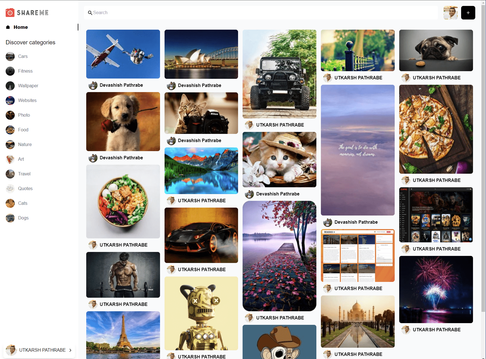
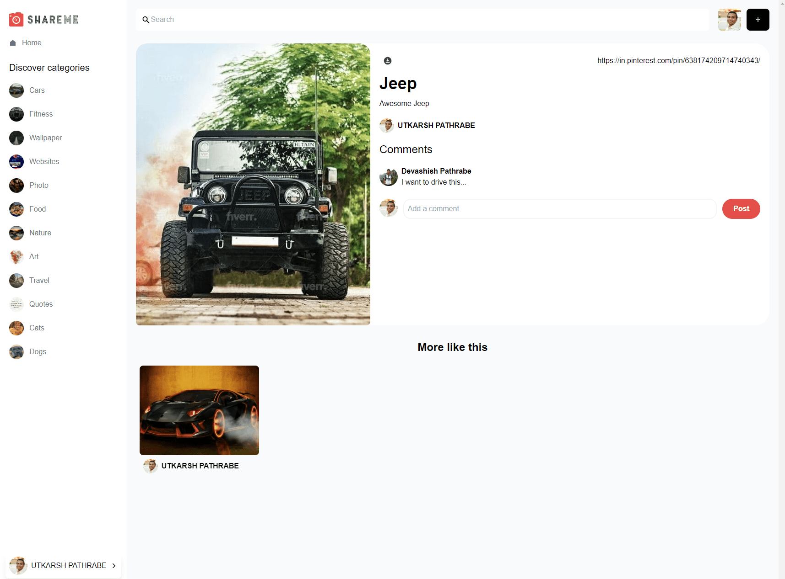
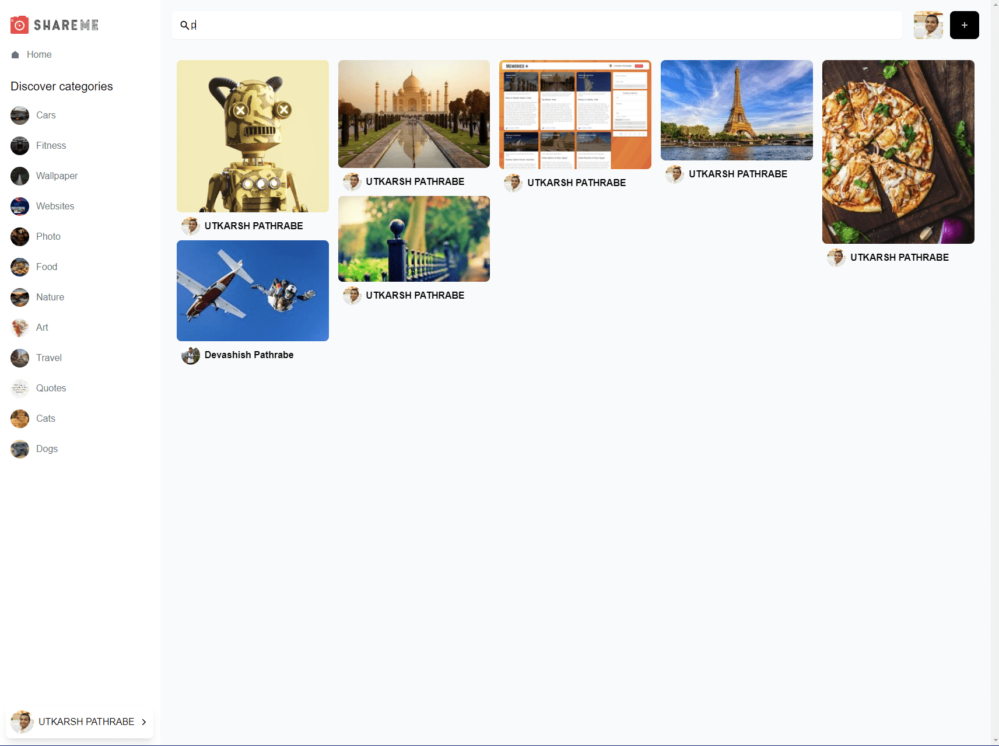

ShareMe
=======

[Live Website](https://utkarsh-pathrabe-shareme.netlify.app/)  

Full stack Social Media application which lets users share photos. It supports all advanced Social Media features, such as Google Authentication, create, edit, delete and save posts, like and comment on other people's posts, search and filter images and much more. The data is managed using Sanity.

  

  

  
